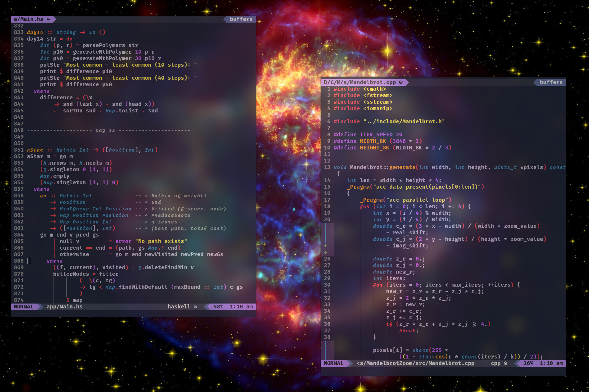

<!-- markdownlint-disable-file -->
<p align="center">
 
</p>

More screenshots [here](./pictures).

### About


Version of [cassiopeia-vim](https://github.com/kozlov721/cassiopeia-vim) for NeoVim written
in Lua.

A clean, dark theme with [TreeSitter](https://github.com/nvim-treesitter/nvim-treesitter) support.
Inspired by the [supernova remnant](https://en.wikipedia.org/wiki/Cassiopeia_A)
in the Cassiopeia constelation.


## This colorscheme only support true colors

### Installation

If you're using [vim-plug](https://github.com/junegunn/vim-plug),
then it's jsut a matter of putting this

```vim
Plug 'kozlov721/cassiopeia-vim'
```

and this to your vim config.

```vim
set termguicolors

let g:cassiopeia_enable_italic = 1

colorscheme cassiopeia
```

### Available configuration

**Note:** The configuration options should be placed before `colorscheme cassiopeia` .

- `g:cassiopeia_transparent_background`: Set to `1` to enable transparent background.
  - Available values: `0`, `1`
  - Default value: `0`
- `g:cassiopeia_menu_selection_background`: Control the background color of `PmenuSel` and `WildMenu` .
  - Available values: `'green'`, `'red'`, `'blue'`
  - Default value: `'green'`
- `g:cassiopeia_disable_italic_comment`: Set to `1` to disable italic in `Comment` .
  - Available values: `0`, `1`
  - Default value: `0`
- `g:cassiopeia_enable_italic`: Set to `1` to italicize keywords. This option is designed to use with fonts that support cursive italic styles.
  - Available values: `0`, `1`
  - Default value: `0`
- `g:cassiopeia_cursor`: Customize the cursor color, only works in GUI clients.
  - Available values: `'auto'`, `'red'`, `'green'`, `'blue'`
  - Default value: `'auto'`
- `g:cassiopeia_current_word`: Some plugins can highlight the word under current cursor(for example [neoclide/coc-highlight](https://github.com/neoclide/coc-highlight)), you can use this option to control their behavior.
  - Available values: `'bold'`, `'underline'`, `'italic'`, `'grey background'`
  - Default value: `'grey background'` when not in transparent mode, `'bold'` when in transparent mode.

### Credits

- [ghifarit53](https://github.com/ghifarit53/tokyonight-vim) for the original plugin (absolutely check this theme)

### License

[MIT](./LICENSE)

