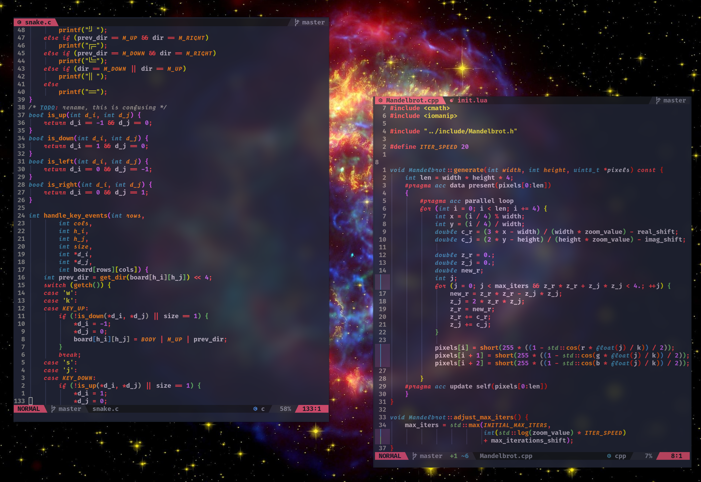

<p align="center">
 
</p>

### About

A clean, dark theme for NeoVim written in Lua.
Supports built-in LSP and [TreeSitter](https://github.com/nvim-treesitter/nvim-treesitter).
Inspired by the [supernova remnant](https://en.wikipedia.org/wiki/Cassiopeia_A)
in the Cassiopeia constelation.


### Installation

#### [Vim Plug](https://github.com/junegunn/vim-plug)
```vim
Plug 'tjdevries/colorbuddy.nvim'
```

#### [Packer](https://github.com/wbthomason/packer.nvim)
```lua
use {'kozlov721/cassiopeia.nvim'}
```

You can then enable the scheme using
```vim
colorscheme cassiopeia
```

You can also use this colorscheme
for [Lualine](https://github.com/nvim-lualine/lualine.nvim)
```lua
require('lualine').setup({
  options = {theme = 'cassiopeia'}
})
```
### License

[MIT](./LICENSE)

